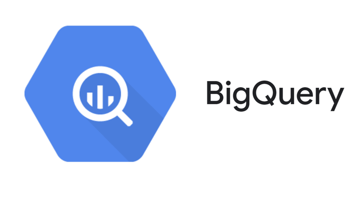
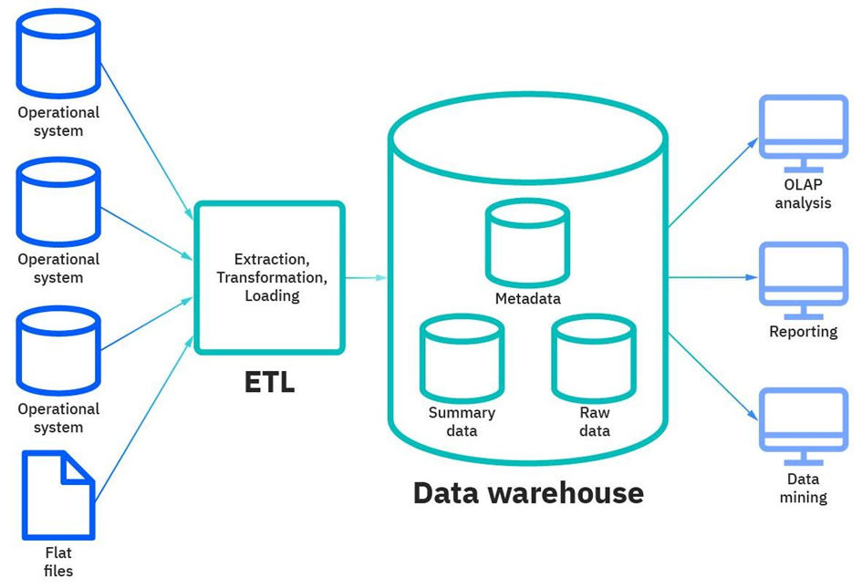

# modern-data-stack-ecommerce
Knowledges about Amazon S3, Fivetran, BigQuery, Google Looker Studio

I. BigQuery là gì?
-

<b>Hình 1: Logo BigQuery</b>

Nguồn ảnh: https://cxl.com/blog/bigquery/
- BigQuery là một kho dữ liệu (data Warehouse) hoạt động trên nền tảng đám mây của Google Cloud cho phép các tổ chức xử lý và phân tích dữ liệu lớn với hiệu suất cao. Không những vậy, nó còn hỗ trợ truy vấn SQL, sử dụng kiến trúc serverless, giúp doanh nghiệp lưu trữ, xử lý và phân tích dữ liệu với quy mô lớn mà không cần quản lý hạ tầng.

II. Kiến trúc của Data Warehouse
-

<b>Hình 2: Logo Kiến trúc 3 tầng của Data Warehouse </b>

- Tầng dữ liệu đầu vào: là tầng cuối cùng của kho dữ liệu, với mục đích thu thập, làm sạch và chuyển đổi dữu liệu từ nhiều nguồn thông qua các quy trình ETL (Extract - Transform - Load) hoặc ELT (Extract - Load - Transform) [1]
- Tầng giữa: bao gồm một máy chủ OLAP (xử lý phân tích trực tuyến) cho phép tốc độ truy vấn nhanh. Các loại mô hình được sử dụng trong tầng này là ROLAP, MOLAP và HOLAP [1]
- Tầng phân tích dữ liệu: đây là tầng trên cùng của mô hình, cho phép người dùng sử dụng những công cụ đặc biệt liên quan đến phân tích [1]
- 
III. Phân biệt DataLake - Database - Data Warehouse
- 
<table>
  <tr>
    <th style="text-align: center;">Nội dung</th>
    <th style="text-align: center;">Database</th>
    <th style="text-align: center;">Data Lake</th>
    <th style="text-align: center;">Data Warehouse</th>
  </tr>
  <tr>
    <td style="text-align: center;">Khái niệm</td>
    <td style="text-align: center;">Là nơi lưu trữ dữ liệu có cấu trúc như thông tin khách hàng, sản phẩm,...</td>
    <td style="text-align: center;">Là nơi lưu trữ một lượng lớn dữ liệu có cấu trúc, bán cấu trúc và không cấu trúc ở dạng thô chưa qua xử lý</td>
    <td style="text-align: center;">Là nơi lưu trữ lượng dữ liệu khổng lồ đã được xử lý, làm sạch, phục vụ việc phân tích</td>
  </tr>
  <tr>
    <td style="text-align: center;">Cấu trúc dữ liệu</td>
    <td style="text-align: center;">Thường là dữ liệu có cấu trúc, được tổ chức theo các trường và hàng cụ thể</td>
    <td style="text-align: center;">Dữ liệu có thể là có cấu trúc, bán cấu trúc và không cấu trúc</td>
    <td style="text-align: center;">Dữ liệu thường là có cấu trúc và đã được chuẩn hóa</td>
  </tr>
  <tr>
    <td style="text-align: center;">Truy vấn thông tin</td>
    <td style="text-align: center;">Chủ yếu là những truy vấn đơn giản hoặc theo mô hình OLTP (Online Transaction Processing)</td>
    <td style="text-align: center;">Có thể thực hiện được những truy vấn phức tạp trên tệp dữ liệu lớn và theo mô hình OLAP</td>
    <td style="text-align: center;">Tối ưu hóa cho việc thực hiện các truy vấn phân tích OLAP</td>
  </tr>
  <tr>
    <td style="text-align: center;">Xử lý dữ liệu</td>
    <td style="text-align: center;">Xử lý theo thời gian thực và đảm bảo tính nhất quán</td>
    <td style="text-align: center;">Xử lý hàng loạt theo mô hình ELT và ETL</td>
    <td style="text-align: center;">Xử lý hàng loạt từ nhiều nguồn, thường là theo mô hình ELT</td>
  </tr>
  <tr>
    <td style="text-align: center;">Chi phí và khả năng mở rộng</td>
    <td style="text-align: center;">Ít tốn kém do có lượng dữ liệu vừa phải và hạn chế khả năng mở rộng</td>
    <td style="text-align: center;">Chi phí dựa trên nhu cầu sử dụng và có khả năng mở rộng</td>
    <td style="text-align: center;">Chi phí linh hoạt do dựa trên nhu cầu sử dụng và có khả năng mở rộng</td>
  </tr>
</table>

<b>Phân biệt DataLake - Database - Data Warehouse </b>

IV. Các đặc trưng của BigQuery
- 
- Một trong những tính năng chính của BigQuery là tách biệt công cụ tính toán và lưu trữ đế mở rộng khi cần thiết, cho phép truy vấn terabyte dữ liệu trong vài giây và petabyte trong vài phút.
- BigQuery cho phép thực hiện các truy vấn trên các tập dữ liệu lớn với độ trễ thấp.
- Hỗ trợ nhiều chức năng để phân tích nâng cao giúp đưa ra những thông tin chính xác, kết hợp là khả năng tổng hợp thông tin và học máy để có thể xây dựng những mô hình dự đoán theo từng chủ đề trong tương lai.
- Cho phép người dùng kiểm soát quyền truy cập của chính mình, mã hóa dữ liệu của mình khi lưu trữ và khi truyền tải.
- Chi phí duy trì sẽ được tiết kiệm khi sử dụng bộ nhớ trên nền tảng đám mây, BigQuery cung cấp những gói cước được định giá để các tổ chức cân nhắc, được tính phí theo lượng dữ liệu truy vấn và dung lượng lưu trữ khi sử dụng.

V. Ưu và nhược điểm của BigQuery
-
- Ưu điểm:
  + BigQuery hoạt động với các tệp dữ liệu và công cụ trực quan hóa đa nền tảng, điển hình như Google Analytics
  + Có thể lưu trữ một khối lượng lớn dữ liệu lên đến hàng terabyte
  + Hỗ trợ truy vấn dữ liệu lớn và xử lý chỉ trong vài giây ngắn
  + Người dùng không cần phải cài đặt hoặc cấu hình bất kỳ cơ sở hạ tầng nào
  + Kết hợp thêm học máy để xây dựng thêm các mô hình dự đoán
- Nhược điểm:
  + Cần có kiến thức cơ bản về SQL trước khi sử dụng BigQuery.
  + Đôi lúc sẽ xuất hiện độ trễ khi truy vấn do khoảng cách địa lý.
  + Chỉ có thể thực hiện một số lượng bảng nhất định mỗi ngày trong giới hạn cho phép nên đôi khi sẽ không phù hợp nếu tệp dữ liệu của bạn bị thay đổi thường xuyên

---
[1] https://bkhost.vn/blog/data-warehouse-kho-du-lieu/

[2] https://viblo.asia/p/chua-phan-biet-duoc-database-data-warehouse-va-data-lake-oK9VyQAqVQR

[3] https://www.linkedin.com/pulse/11-ph%C3%A2n-bi%E1%BB%87t-data-mesh-vs-lake-warehouse-mart-phuong-thao-analytics/

[4] https://www.confluent.io/learn/databases-data-lakes-and-data-warehouses-compared/