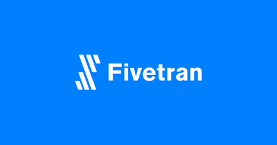
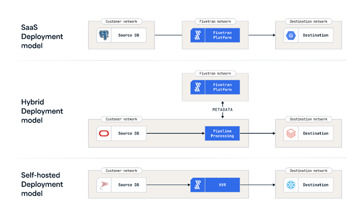

# modern-data-stack-ecommerce
Knowledges about Amazon S3, Fivetran, BigQuery, Google Looker Studio

I. Fivetran là gì?
- 

<b>Hình 1: Logo Fivetran</b>

Nguồn ảnh: https://solutionsreview.com/data-integration/fivetran-acquires-teleport-data-releases-fivetran-teleport-sync/

- Fivetran là một nền tảng tự động hóa hoạt động trên đám mây, có khả năng trích xuất, tải và chuyển đổi giữa nhiều nguồn khác nhau.

II. Kiến trúc về Fivetran
- 

<b>Hình 2: Kiến trúc về Fivetran</b>

Nguồn ảnh và thông tin: https://fivetran.com/docs/core-concepts/architecture

- Mô hình triển khai Saas: cho phép các doanh nghiệp không cần phải can thiệp vào việc xử lý dữ liệu, mọi việc xử lý sẽ được thực hiện hoàn toàn trên đám mây của fivetran với khaonr đầu tư tài nguyên nội bộ tối thiểu.
- Mô hình triển khai Hybrid: cho phép các tổ chức xử lý dữ liệu trong mạng cục bộ vì lí do bảo mật nhưng vẫn tận dụng đám mây của Fivetran để sắp xếp và cấu hình mọi hoạt động của dữ liệu.
- Mô hình triển khai Self-Hosted: sử dụng giải pháp Fivetran HVR - cho phép các tổ chức tự lưu trữ và cung cấp khả năng chạy công nghệ fivetran trên máy chủ của riêng họ, làm tất tần tật mọi viêc từ sắp xếp, cấu hình, quản lý thông tin theo thời gian thực và triển khai mã

III. Ưu và nhược điểm của fivetran
-
- Ưu điểm:[1]
 + Quản lý các kết nối từ nhiều nguồn dữ liệu một cách dễ dàng
 + Tự động việc đồng bộ dữ liệu, chạy các công việc chuyển đổi dữ liệu
 + Dễ dàng trong việc triển khai và quản lý các dự án của doanh nghiệp
- Nhược điểm: [2]
 + Chi phí tăng cao nếu không biết quản lý lưu lượng dữ liệu cần xử lý
 + Vẫn chưa có nhiều công cụ kết nối trong việc chuyển đổi dữ liệu 
 + Chức năng của HVR (HIgh Volume Replication - Công nghệ đồng bộ dữ liệu theo thời gian thực) đôi khi chậm trễ vì nhiều lí do và cần giám sát thêm.
 + Nếu Fivetran gặp lỗi hoặc gián đoạn, quá trình đồng bộ hóa sẽ bị ảnh hưởng
---
[1]Nguồn: https://www.fivetran.com/blog/communicating-fivetran-benefits?utm_source=chatgpt.com

[2]Nguồn: https://www.peerspot.com/products/fivetran-pros-and-cons