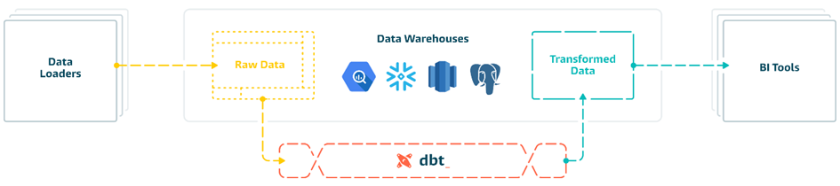

# modern-data-stack-ecommerce
Knowledges about Amazon S3, Fivetran, BigQuery, Google Looker Studio

I. dbt là gì?
-

<b>Hình 1: Logo của dbt </b>

Nguồn ảnh: https://janzednicek.cz/en/category/dbt-en/

- dbt là viết tắt cho Data Build Tool, là một nền tảng phần mềm mã nguồn mở được thiết kế để giải quyết phần T trong ELT. Khi dữ liệu đã được lưu trữ trong kho dữ liệu, lúc này là thời điểm DBT sẽ làm việc với dữ liệu dạng thô (raw data) chuyển hóa thành những dữ liệu thành dạng để phân tích. [1]
- dbt cung cấp ít chức năng trong quá trình transform hơn các ETL tool khác như Airflow, Luigi,... nhưng bù lại thì dễ sử dụng đối với những bạn non-tech. [2]

II. Cách thức hoạt động của DBT
-

<b>Hình 2: Cách thức hoạt động của dbt </b>

Nguồn ảnh: https://evalusken.blogspot.com/2021/01/dbt-data-build-tool-tutorial.html

- Dựa theo chu trình hoạt động của ELT (Extract - Load - Transform) thì dbt đại diện cho phần T - Transform. dbt sẽ lấy dữ liệu trong kho dữ liệu sau đó biển đổi dữ liệu từ phần thô sang dạng dữ liệu có thể phân tích. Sau đó sẽ được sử dụng để xây dựng các mô hình dữ liệu và lưu trữ tại cùng một kho dữ liệu trước đó. 

III. Phân biệt DBT Core và DBT Cloud
-
<table>
  <tr>
    <th style="text-align: center;">Nội dung</th>
    <th style="text-align: center;">DBT Core</th>
    <th style="text-align: center;">DBT Cloud</th>
  </tr>
  <tr>
    <td style="text-align: center;">Khái niệm</td>
    <td style="text-align: center;">Là một phiên bản mã nguồn mở của DBT</td>
    <td style="text-align: center;">Là phiên bản dịch vụ được cung cấp bởi DBT</td>
  </tr>
  <tr>
    <td style="text-align: center;">Cách thức hoạt động</td>
    <td style="text-align: center;">Người dùng tự cấu hình và quản lý</td>
    <td style="text-align: center;">Được quản lý bởi DBT Labs</td>
  </tr>
  <tr>
    <td style="text-align: center;">Hạ tầng sử dụng</td>
    <td style="text-align: center;">Hoạt động cục bộ hay hệ thống máy chủ riêng</td>
    <td style="text-align: center;">Hoạt động trên nền tảng đám mây</td>
  </tr>
  <tr>
    <td style="text-align: center;">Chi phí vận hành</td>
    <td style="text-align: center;">Miễn phí do là mã nguồn mở</td>
    <td style="text-align: center;">Trả phí dựa trên quy mô sử dụng</td>
  </tr>
  <tr>
    <td style="text-align: center;">Khả năng mở rộng</td>
    <td style="text-align: center;">Quyết định bởi tài nguyên hệ thống cục bộ</td>
    <td style="text-align: center;">Có khả năng mở rộng theo nhu cầu người sử dụng</td>
  </tr>
  <tr>
    <td style="text-align: center;">Bảo trì</td>
    <td style="text-align: center;">Thực hiện thủ công về bảo trì và sửa chữa hệ thống</td>
    <td style="text-align: center;">Tự động hóa các bản cập nhật phần mềm của nền tảng</td>
  </tr>
</table>

<b>Bảng 1: Phân biệt DBT Cloud và DBT Core </b>

